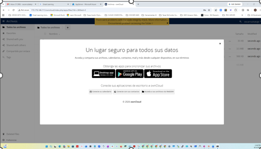

# azure-two-tier-owncloud-deployment
# 🌐 Secure Two-Tier App Deployment on Microsoft Azure

An enterprise-grade infrastructure deployment implementing a secure, highly isolated two-tier network architecture on Microsoft Azure to host a private ownCloud storage application.

---

## 🏗️ Architecture Design Overview

The core objective of this deployment is to isolate sensitive backend assets while maintaining seamless communication channels with the web tier. The environment is partitioned into explicit operational zones:

*   **Presentation Tier (AppServer):** A public-facing Ubuntu virtual machine running Apache 2 and configured with an optimized PHP runtime to host the ownCloud interface.
*   **Data Tier (DBServer):** A completely isolated backend Ubuntu instance hosting the MySQL database server, restricted to a private subnet with no assigned public endpoints.
*   **Network Security Layers:** Strict ingress and egress boundaries enforced through distinct Network Security Groups (NSGs) mapping granular TCP rules.
*   
+-------------------------------------------------------+
|                    VIRTUAL NETWORK                    |
|                     10.0.0.0/16                       |
|                                                       |
|  +-----------------------+     +-------------------+  |
|  |     PUBLIC SUBNET     |     |  PRIVATE SUBNET   |  |
|  |     10.0.1.0/24       |     |   10.0.2.0/24     |  |
|  |                       |     |                   |  |
|  |  [App Web Server]     |====>|  [MySQL Database] |  |
|  |  Ports: 22, 80        |     |  Ports: 22, 3306  |  |
|  +-----------▲-----------+     +---------▲---------+  |
+--------------|---------------------------|------------+
|                           |
[Web Browser]               [NAT Gateway]
---

## 🛠️ Key Technical Proficiencies Demonstrated

### ☁️ Cloud Infrastructure Mapping
*   **Segmented Networking:** Managed Virtual Network (VNet) architectures by implementing dedicated multi-tier subnets, custom routing tables, and explicit infrastructure endpoints.
*   **Traffic Management:** Configured explicit inbound and outbound rules over asymmetric security filters via specific Azure Network Security Groups (NSGs).
*   **Gateway Integrations:** Initialized and associated NAT Gateways to grant private database services secure outbound connectivity for patch management.

### 🐧 System Administration & Scripting
*   **Advanced Environment Troubleshooting:** Mitigated complex package lifecycle conflicts by engineering custom runtime configurations and switching standard PHP processing stacks down to target stable dependencies.
*   **Secure Access Schemes:** Conducted remote cross-VM environment migrations leveraging asymmetric key cryptography (`ssh-keygen` and `.pem` file scopes) combined with recursive automated ownership management (`chown`/`chmod`).

### 🗄️ Database Management & Application Scaling
*   **Database Scoping:** Deployed scalable relational backend models utilizing customized user host grants, isolated root definitions, and tailored application endpoints (`3306`).
*   **Application Integrity Validation:** Successfully compiled, isolated, and established runtime execution frameworks across strict file directory boundaries in standard web directories.

---

## 🔍 Validation and Execution

The deployment lifecycle was thoroughly tested and certified through the following verification checkmarks:

1.  **Asymmetric Cryptography Verification:** Validated multi-hop private subnet access over SSH using a secure administrative path.
2.  **Runtime Compliance:** Resolved legacy interface conflicts in multi-version application dependencies to remove system-level runtime halts (*HTTP Error 500*).
3.  **Data Binding Success:** Initialized real-time state tracking and active administrative access to the persistent target data engine via standard web endpoints.

---

## 📸 Production Environment Verification

The following deployment output confirms successful multi-tier operational compliance, end-to-end data binding via explicit database host vectors, and interface accessibility:

---

> 💡 *Note: All production test nodes and associated subscription-based elements were systematically decommissioned upon architecture certification to maintain explicit cost controls.*
